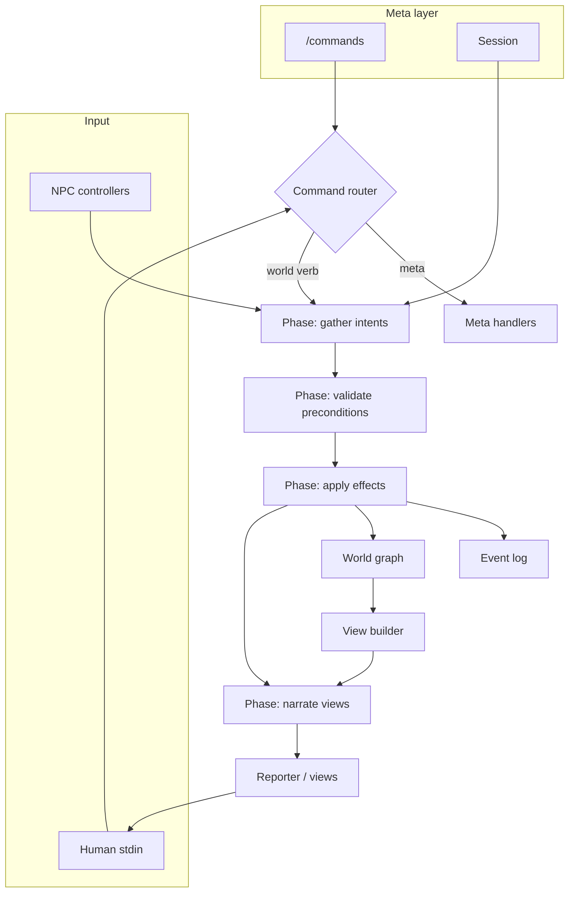
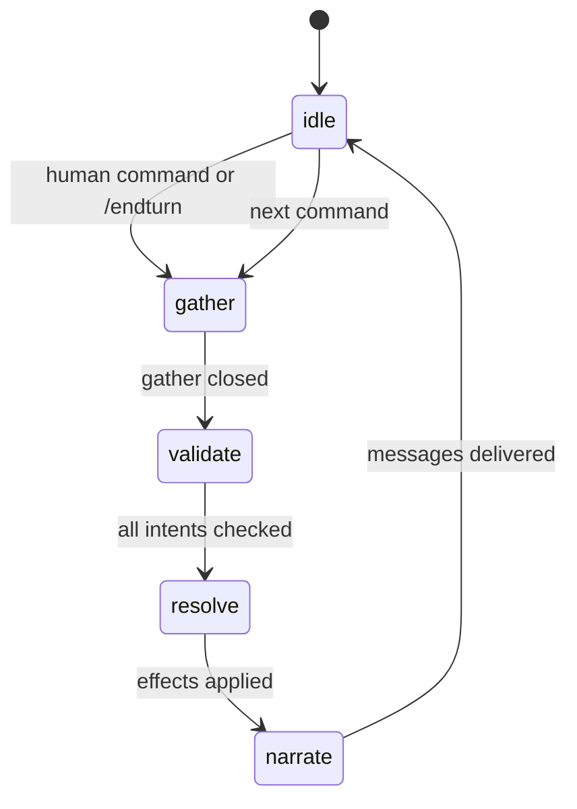

# Multi-Character Play Design

This document describes a proposed extension to `text_adventure_games` where **every character can act**, not only a single designated player. The design combines three ideas discussed for managing game state:

1. **Actor-centric state** — each `Character` is a full agent with a controller, turn flags, and optional goals.
2. **Phased ticks** — each turn runs through gather → validate → resolve → narrate.
3. **Split world and presentation** — the world graph is shared truth; what gets printed depends on who is viewing.

The human interface adds **slash commands** (e.g. `/switch`) for meta-actions that do not change the world. **No LLMs** are assumed: NPCs use scripts, behavior rules, or simple planners.

For how the current library works today, see [LIBRARY.md](./LIBRARY.md).

---

## Goals and non-goals

### Goals

- Control **multiple characters** in one session (hot-seat or switching focus).
- Run **NPC turns** after human input using the same action pipeline as the player.
- Keep **one authoritative world** (locations, items, characters) while narrating **per-viewer** descriptions.
- Support **replay and debugging** via an append-only event log.
- Preserve compatibility with existing **actions**, **preconditions**, and **save/load** where possible.

### Non-goals (for this design)

- Network multiplayer or concurrent human players.
- LLM-driven dialogue or planning.
- Real-time / simultaneous action without a phased resolve step.

---

## Relationship to the current library

Today the library is already **partially multi-character**:

- `Game.characters` holds all actors; `Location.characters` tracks who is where.
- Many actions call `parser.get_character(command)` and default to `game.player`.
- `Go`, `Get`, `Eat`, etc. can mutate any character if their name appears in the command.

What is still **single-actor**:

| Area | Current behavior |
|------|------------------|
| `Game.game_loop()` | One `input()` loop; no turn order |
| `Game.describe_*()` | Always uses `game.player.location` |
| `Parser.get_character()` | Defaults to `game.player` |
| `Go.apply_effects()` | Room visit + game-over only for `game.player` |
| `Game.is_game_over()` | Only checks `game.player` death |
| Output | `parser.ok()` / `fail()` print immediately to stdout |

The extension **does not replace** the world model. It adds a **session layer** on top of `Game` and refactors narration and the main loop.

---

## High-level architecture



**World commands** (`go north`, `take shovel`) go through the phased tick and may change locations, items, or character properties.

**Meta commands** (`/switch gravedigger`) update session state only (active character, party list, help text). They never call `apply_effects()` on world actions.

---

## Core concepts

### 1. Actor-centric `Character`

Extend `Character` (or wrap it) with fields that describe **who controls** the character and **whether they have acted** this tick.

| Field | Type | Purpose |
|-------|------|---------|
| `controller` | `"human"` \| `"npc"` \| `"none"` | Who supplies commands |
| `controllable` | `bool` | Whether a human may `/switch` to this character |
| `has_acted_this_tick` | `bool` | Cleared at start of each tick; set when an action resolves |
| `action_budget` | `int` (optional) | Max actions per tick (default 1) |
| `goals` | `dict` (optional) | NPC script hooks, e.g. `{"wants": "shovel"}` |

`game.player` can remain as the **story protagonist** (win/lose hooks, tutorial text) while `session.active_character` is **who you control right now**. They are often the same at game start but need not stay that way.

**Controller rules (suggested defaults):**

| `controller` | Gathers input from | Typical use |
|----------------|-------------------|-------------|
| `human` | `input()` when `active_character` | Player-controlled party members |
| `npc` | `NPCController.plan()` during gather | Shopkeeper, companion, enemy |
| `none` | Never | Corpses, scenery characters, cutscene extras |

Only characters with `controller == "human"` and `controllable == True` appear in `/switch` autocomplete.

### 2. `Session` — orchestration state

A new object owned by `Game` (or composed into it):

```python
class Session:
    turn: int = 0
    phase: Literal["idle", "gather", "validate", "resolve", "narrate"] = "idle"
    active_character: Character | None = None
    party: list[str]              # character names the human may control
    tick_intents: list[Intent]    # collected during gather, cleared each tick
    event_log: list[GameEvent]    # append-only history
```

| Field | Purpose |
|-------|---------|
| `turn` | Increments after a full phased tick completes (or after ` /endturn`) |
| `active_character` | Who receives unprefixed commands and whose prompt is shown |
| `party` | Subset of `game.characters` the player may switch to |
| `tick_intents` | Staging area before validate/resolve |
| `event_log` | Serializable record of what happened |

**Starting a game:** set `active_character = player`, `party = [player.name]`, run an initial `Describe` for that viewer.

### 3. `Intent` — structured command before resolution

Replace ad-hoc “parse string twice” with an explicit intent for each actor per tick:

```python
@dataclass
class Intent:
    actor: Character
    raw_command: str
    action_class: type[Action] | None = None
    action_instance: Action | None = None
    source: Literal["human", "npc", "system"] = "human"
    status: Literal["pending", "valid", "invalid", "resolved", "skipped"] = "pending"
    failure_reason: str | None = None
```

Flow:

1. **Gather** — build `Intent(actor, raw_command)` from human input or NPC planner.
2. **Validate** — instantiate action, run `check_preconditions()` without mutating world (or with a dry-run flag).
3. **Resolve** — for valid intents in order, call `apply_effects()`.
4. **Narrate** — emit messages from results and events.

Human input while `active_character` is set usually creates one intent. NPCs may contribute zero or more intents per tick depending on game rules.

### 4. `GameEvent` — event log entries

Each resolved change appends a small record:

```python
@dataclass
class GameEvent:
    turn: int
    tick_index: int          # order within resolve phase
    actor: str               # character name
    action: str              # e.g. "go", "get"
    summary: str             # human-readable one-liner
    payload: dict            # optional structured diff
```

Examples:

```text
Turn 2 | gravedigger | go | Gravedigger moved north to Churchyard
Turn 2 | ghost | get | Ghost took the lantern (contested: gravedigger lost)
```

The log supports debugging, save-game continuity, and “what did I miss?” summaries via `/log`.

### 5. `View` — presentation state (split from world)

**World state** is whatever is true in `Location` / `Item` / `Character` objects.

**Presentation** is built on demand for a **viewer**:

```python
class View:
    viewer: Character
    location: Location
    visible_exits: list[str]
    visible_items: list[Item]
    visible_characters: list[Character]
    inventory: dict[str, Item]
    room_description: str
    knowledge_flags: set[str]   # optional: "knows_door_unlocked"
```

Factory: `View.build(game, viewer)` reads the world graph but applies **visibility rules**:

| Rule | Default |
|------|---------|
| Room text | `viewer.location.description` |
| Items | Items at `viewer.location` + own inventory |
| Other characters | Others at same location (exclude self from “others” list) |
| Distant rooms | Not visible unless `viewer` has visited or has a property like `knows_about_X` |
| Other inventories | Hidden unless action or `/examine` reveals them |

`Game.describe()` becomes `Game.describe_viewer(viewer: Character) -> str` using `View`, not hard-coded `self.player`.

---

## Phased tick (detailed)

One **tick** is one unit of simulation time. A tick can include actions from the active human **and** from NPCs (depending on settings).

### Phase diagram



### Phase 1: Gather

**Human path**

1. Read a line from stdin (or injected command in tests).
2. If line starts with `/`, route to meta handler (see below); **do not** start a world tick unless the meta command says so (e.g. `/endturn`).
3. Otherwise attach line to `Intent(actor=session.active_character, raw_command=line)`.
4. Optionally append to `tick_intents` immediately, or hold a single “pending human intent” until the player runs `/endturn` (design choice; see **Tick modes**).

**NPC path**

After human gather closes (automatic on each command, or explicitly via `/endturn`):

```python
for character in game.characters.values():
    if character.controller == "npc" and not character.get_property("is_dead"):
        cmd = npc_controller.plan(game, character)
        if cmd:
            tick_intents.append(Intent(actor=character, raw_command=cmd, source="npc"))
```

`NPCController` is a protocol:

```python
class NPCController(Protocol):
    def plan(self, game: Game, character: Character) -> str | None: ...
```

Implementations: `ScriptedController` (if location == X: return "go north"), `IdleController` (always None), `PatrolController` (cycle directions).

### Phase 2: Validate

For each intent in stable order (see **Ordering**):

1. `action = parser.parse_action(intent.raw_command, actor=intent.actor)`  
   — pass `actor` explicitly so unprefixed commands do not re-scan for names in the string.
2. `intent.action_instance = action`
3. If `action is None`: mark `invalid`, set `failure_reason`.
4. Else if `not action.check_preconditions(dry_run=True)` (or call existing `check_preconditions` if dry-run is not implemented yet): mark `invalid`.
5. Else mark `valid`.

**Important:** Validate must not move items or characters. If preconditions currently mutate state, add a `dry_run` parameter to `Action` over time.

Collect validation messages but do not print yet (batch for narrate).

### Phase 3: Resolve

Process **valid** intents in order:

1. `action.apply_effects()`
2. Set `actor.has_acted_this_tick = True`
3. Append `GameEvent` to `session.event_log`
4. Mark intent `resolved`

**Invalid** intents are skipped; their failure reasons go to narrate.

### Phase 4: Narrate

Build output per **audience**:

| Audience | Sees |
|----------|------|
| `active_character` (human) | Full detail for their intents; short third-person for others in same room |
| Same-room observers | Third-person summaries of others’ actions |
| Remote characters | Nothing unless you add a global “rumor” channel later |

Implementation sketch:

```python
class Reporter:
    def emit(self, message: Message): ...
    def flush(self, viewer: Character): ...

@dataclass
class Message:
    text: str
    audience: Literal["actor", "room", "global", "private"]
    actor: Character | None = None
    location: Location | None = None
```

After resolve, call `game.describe_viewer(session.active_character)` if the active character changed location or a `look` happened.

Clear `tick_intents`, increment `session.turn`, reset `has_acted_this_tick` on all characters.

---

## Tick modes

Two modes fit different game feels; pick one per game or make it a `Session` setting.

### Mode A: Immediate tick (default for simplicity)

Every world command runs a **full tick** immediately:

1. Gather human intent  
2. Gather NPC intents  
3. Validate → Resolve → Narrate  

Good for: solo play with reactive NPCs, homework-scale games.

### Mode B: Plan then `/endturn`

Human can queue multiple commands for **party members** (each prefixed or switched), then `/endturn` runs NPCs and resolves everything.

Good for: tactical play, “program your party” puzzles.

| Mode | Human issues | NPCs run |
|------|--------------|----------|
| A | One command → one tick | After each human command |
| B | Many commands → `/endturn` | Once per end turn |

---

## Slash commands (meta layer)

Meta commands start with `/`. They are parsed **before** intent gathering and **do not** require a location or action preconditions.

Suggested grammar:

```text
/<verb> [arguments...]
```

Parsing: split on whitespace; first token is verb (case-insensitive); rest are args.

### Built-in commands

| Command | Args | Effect |
|---------|------|--------|
| `/help` | — | List world verbs + slash commands |
| `/who` | — | List controllable characters; mark active with `*` |
| `/switch` | `<name>` | Set `session.active_character` if in `party` and controllable |
| `/party` | `[add\|remove] <name>` | Show party, or add/remove controllable members |
| `/status` | `[name]` | Properties, location, inventory for active or named character |
| `/look` | — | `describe_viewer(active_character)` without spending a world action (optional) |
| `/endturn` | — | Close gather, run validate → resolve → narrate (Mode B; no-op in Mode A or runs NPC-only pass) |
| `/log` | `[n]` | Last `n` events from `event_log` (default 10) |
| `/turn` | — | Print current turn number and phase |
| `/save` | `[path]` | Serialize game + session |
| `/load` | `<path>` | Load game + session |
| `/quit` | — | Same as `quit` meta-action; end session |

### `/switch` behavior (detail)

```text
> /who
* you (garden)
  gravedigger (churchyard)
  ghost (crypt) [not controllable]

> /switch gravedigger
Now controlling: gravedigger (churchyard)

> look
You are in the churchyard...
```

Rules:

1. Target must be in `session.party`.
2. Target must have `controllable=True` and not `is_dead`.
3. Update `session.active_character` only; **do not** move characters in the world.
4. Optional: print a one-line room description on switch (presentation only).

Invalid switch:

```text
> /switch ghost
You cannot control ghost.
```

### `/party` behavior (detail)

- `/party` — list names in party.  
- `/party add gravedigger` — after story gate (e.g. befriended), add to party and set `controllable=True`.  
- `/party remove gravedigger` — remove from party; if active, switch to `game.player` or first party member.

Game authors gate `/party add` in story code when an NPC joins the player’s group.

### Extensibility

Register custom meta commands per game:

```python
game.session.register_meta("map", handler=show_ascii_map)
```

```text
> /map
[Garden]--north--[Castle]
```

Keep the registry separate from `parser.actions` to avoid polluting world verbs.

---

## Command router

Single entry point replaces raw `parser.parse_command` in the loop:

```python
def handle_input(game: Game, line: str) -> None:
    line = line.strip()
    if not line:
        return
    if line.startswith("/"):
        game.meta.execute(line)
        return
    intent = Intent(actor=game.session.active_character, raw_command=line, source="human")
    game.session.run_tick(human_intent=intent)
```

`run_tick`:

```python
def run_tick(self, human_intent: Intent | None = None):
    self.phase = "gather"
    intents = []
    if human_intent:
        intents.append(human_intent)
    intents.extend(self.gather_npc_intents())
    self.phase = "validate"
    self.validate_all(intents)
    self.phase = "resolve"
    self.resolve_all(intents)
    self.phase = "narrate"
    self.narrate_all(intents)
    self.phase = "idle"
    self.turn += 1
```

---

## Changes to `Parser` and `Action`

### Explicit actor parameter

```python
def parse_action(self, command: str, actor: Character) -> Action | None:
    intent = self.determine_intent(command, actor=actor)
    ...
```

`determine_intent` uses `actor.location` for direction matching instead of assuming `game.player`.

Deprecate implicit default in `get_character(command)` when `actor` is already known; keep name-in-string override for author commands like `gravedigger, go north`.

### Action constructors

Prefer:

```python
class Get(Action):
    def __init__(self, game, command: str, actor: Character):
        super().__init__(game)
        self.character = actor
        ...
```

### Reporting instead of printing

Replace direct `print` in `ok` / `fail` with `Reporter.emit` so narrate phase can order messages and target audiences.

Backward compatibility: `Parser.ok` can call `Reporter.emit` and still print during transition.

### Describe action

```python
def apply_effects(self):
    viewer = self.actor  # from session.active or explicit
    self.reporter.emit(Message(
        text=self.game.describe_viewer(viewer),
        audience="actor",
        actor=viewer,
    ))
```

---

## Ordering and conflicts

When two valid intents compete (both `get lantern`), define policy on `Session`:

| Policy | Behavior |
|--------|----------|
| `initiative` (default) | Sort by character `initiative` property (int), then party order |
| `gather_order` | First gathered wins |
| `all_or_nothing` | If conflict detected in validate, both fail |

**Conflict detection (validate phase):**

- Same target item in two `get` intents at same location.  
- Two `go` into a one-tile choke point (optional advanced rule).

Loser gets `failure_reason = "Someone else got there first."` and narrate prints both attempts.

---

## Win, lose, and `game.player`

Keep `game.player` as **narrative focus** but generalize checks:

```python
def is_game_over(self) -> bool:
    if self.game_over:
        return True
    if self.player.get_property("is_dead"):
        ...
    if self.session.party_lost():  # optional: all party dead
        ...
    return self.is_won()
```

`Go` should set `location.has_been_visited` for **any** character entering, or only for party members — document per game.

Game-over locations: trigger if **any** party member enters, or only `game.player`; make it a `Location` property `game_over_for: "player" | "party" | "any"`.

---

## NPC controllers (no LLM)

### Scripted example

```python
class GravediggerAI:
    def plan(self, game, character):
        if character.location.name == "churchyard":
            if "shovel" not in character.inventory:
                return "take shovel"
        if character.location.name == "garden":
            return "go north"
        return None
```

Wire at game setup:

```python
gravedigger = Character(..., controller="npc")
game.register_npc_controller(gravedigger.name, GravediggerAI())
```

### Shared patterns

| Pattern | `plan()` returns |
|---------|------------------|
| Idle | `None` |
| Patrol | Next direction from a cycle |
| Follow | `go <dir>` toward `game.player.location` |
| Use item | `light lamp` when dark and in inventory |
| React | If event log contains `"attack"` on self, return `"attack <name>"` |

NPCs only see what their `View` allows — same as humans — so “cheating” requires explicit `knowledge_flags` on the character.

---

## Save and load

Extend `to_primitive()`:

```json
{
  "player": "you",
  "session": {
    "turn": 5,
    "active_character": "gravedigger",
    "party": ["you", "gravedigger"],
    "phase": "idle",
    "event_log": [
      {"turn": 4, "actor": "ghost", "action": "go", "summary": "..."}
    ]
  },
  "characters": [ ... ],
  "locations": [ ... ]
}
```

On load:

1. Rebuild world graph (existing passes).  
2. Restore `Session` fields.  
3. Rebind `active_character` object from `characters` dict.  
4. Re-register NPC controller objects (not serialized — restore by name via game subclass `on_load()`).

---

## Proposed module layout

```
text_adventure_games/
├── session.py       # Session, Intent, GameEvent, tick runner
├── meta.py          # MetaCommandRegistry, built-in /commands
├── views.py         # View.build, visibility rules
├── reporting.py     # Message, Reporter
├── npc.py           # NPCController protocol, reference implementations
├── games.py         # Game uses session; describe_viewer
└── parsing.py       # Router; parse_action(..., actor=...)
```

Homework games opt in via `MultiCharacterGame(Game)` or flags on `Game.__init__(multi_character=True)`.

---

## Example session (Mode A)

Setup: `you` in garden (human), `gravedigger` in churchyard (npc), `ghost` in crypt (`controller=none`).

```text
> look
You are in a walled garden...
Exits:
North to churchyard

> /who
* you (garden)
  gravedigger (churchyard)

> go north
You enter the churchyard. The gravedigger mutters over a fresh plot.
[Tick 1] gravedigger: take shovel — Gravedigger picked up the shovel.

> /switch gravedigger
Now controlling: gravedigger (churchyard)

> inventory
In your inventory: shovel

> /switch you
Now controlling: you (churchyard)

> get shovel
Someone else got there first.
[Gravedigger already took the shovel this tick.]

> examine gravedigger
The gravedigger clutches a shovel and avoids your gaze.
```

---

## Migration checklist

Implement in roughly this order:

1. **`Session` + `active_character`** — minimal; no phased tick yet.  
2. **Meta commands** — `/switch`, `/who`, `/party`, `/help`.  
3. **`describe_viewer` / `View`** — remove `game.player` from description paths.  
4. **`parse_action(..., actor=)`** — thread actor through actions.  
5. **`Reporter`** — decouple print from effects.  
6. **`run_tick` + NPC gather** — phased pipeline.  
7. **`GameEvent` log + `/log`** — persistence.  
8. **Conflict policy + dry-run preconditions** — polish simultaneous effects.  
9. **Save/load session blob** — full continuity.

Each step should keep single-character games working when `session` is absent or `party == [player.name]` only.

---

## Design notes

- **Slash vs colon:** `/switch` avoids clashing with in-world verbs; colon prefixes (`gravedigger: go north`) remain optional for author-style commands.  
- **Prompt:** Show active actor — `[gravedigger@churchyard] > ` — reduces confusion in hot-seat play.  
- **Testing:** Inject `handle_input(game, line)` without stdin; assert on `event_log` and world graph after `run_tick`.  
- **Performance:** Event log can be capped (ring buffer) for long sessions; `/log` reads from tail.

This design keeps the existing **action precondition / effect** pattern as the single way world state changes, while session, views, and meta commands handle **who acts**, **when**, and **what each character sees**.
